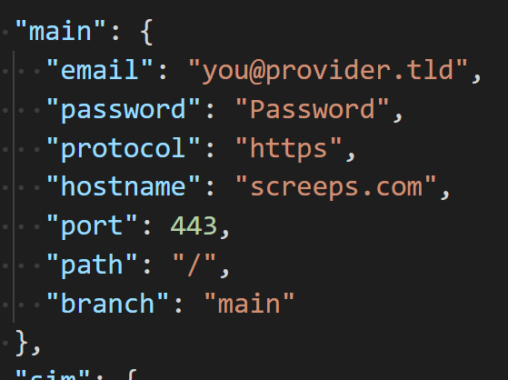

# Deploying

## Building Configuration Files

The starter kit builds your code using `rollup`, which uses a `screeps.json` file as its configuration file. A sample config file is provided within the project, to use it, simply make a copy and rename it to `screeps.json`.

```bash
cp screeps.sample.json screeps.json
```

> **IMPORTANT:** The `screeps.json` file contains your Screeps credentials. If you use any source control, **DO NOT** check in this file into your repository.

[TODO: move to 'in-depth']

The `screeps.json` file is a JSON configuration file that can be separated into multiple environments. We've given you three primary environments by default.

```json
{
  // Used for deploying to the main world
  "main": {
    "email": "you@provider.tld",
    "password": "Password",
    "protocol": "https",
    "hostname": "screeps.com",
    "port": 443,
    "path": "/",
    "branch": "main"
  },
  // Used for deploying to Simulation mode
  "sim": {
    "email": "you@provider.tld",
    "password": "Password",
    "protocol": "https",
    "hostname": "screeps.com",
    "port": 443,
    "path": "/",
    "branch": "sim"
  },
  // Used for deploying to a private server
  "pserver": {
    "email": "username",
    "password": "Password",
    "protocol": "http",
    "hostname": "1.2.3.4",
    "port": 21025,
    "path": "/",
    "branch": "main"
  }
}
```

We're going to focus on the `main` environment as a starter. Fill in your Screeps credentials accordingly, along with your target branch.

> **Note:** You don't have to manually create the branch in your Screeps client if it doesn't exist yet. `rollup` will do it for you.

Once you're done, run the following command:

```bash
npm run push-main
```

Now go to your Screeps client and make sure your code is deployed properly.


